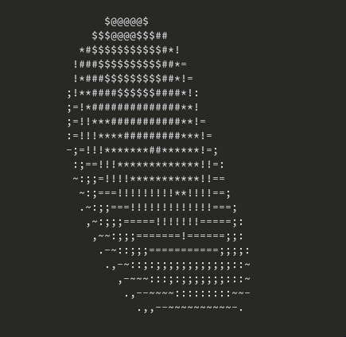

# donut-ports

Ports of Andy Sloane's [donut.c](https://www.a1k0n.net/2006/09/15/obfuscated-c-donut.html).

For the explanation of how `donut.c` works, see [his blog post](https://www.a1k0n.net/2011/07/20/donut-math.html).

## Gallery

### Python

### PICO-8

